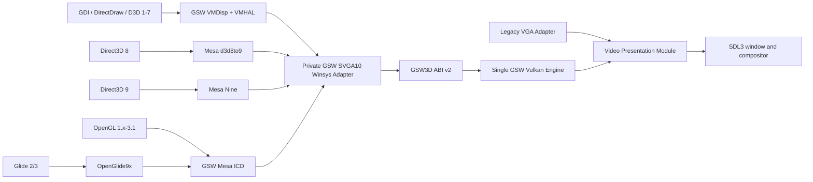

<!-- SPDX-License-Identifier: GPL-3.0-only -->

# RETVRN99 Full GSW Graphics Stack

## Status

Approved implementation plan. This document fixes the target architecture and
release gates. It is not evidence that a phase, capability, build, installation,
or guest-runtime gate has passed. Each claim remains disabled until its named
proof is complete.

### Implementation progress: 2026-07-21

- Phase 1 provenance infrastructure and normalized generated-source
  reproducibility are present, but the Phase 1 gate remains open. The exact
  direct-build inventory contains 837 upstream source units, 35 generated
  source units, and two original GSW source units. Of those 874 units, 869 have
  dependency-only compiler commands and five generated files are explicitly
  support-only.
- The pinned i686 compiler completed 869 exact dependency-only commands twice.
  The proof source root contains exactly 1,489 files: 837 selected upstream
  sources plus 652 observed upstream dependencies. The resulting 1,738
  normalized depfiles are byte-identical and close 1,070 unique source,
  generated, original, and toolchain dependencies. This is not object
  compilation, a production build, or artifact activation. Upstream
  project-header license review remains open.
- An original capability-disabled GSW `svga_winsys_screen` shell now populates
  all 32 screen callbacks and all 17 context callbacks. It reports a pre-WS8
  hardware version, exposes no capabilities, rejects resource and fence-FD
  operations, emits no ABI traffic, and retains failed-create ownership. This
  is only a fail-closed Interface shell and does not implement the Phase 7 ABI
  v2 Adapter.
- OpenGL, Direct3D, Nine, d3d8to9, Glide, SVGA10 decoding, Vulkan rendering,
  build, link, staging, payload, installation, DLL activation, and capability
  authorization all remain disabled. The graphics stack is not integrated.

## Summary and fixed decisions

Build a full-featured Windows 98 graphics stack around one private GSW-VGA
device and one Vulkan Implementation. SoftGPU is a knowledge and source donor,
not a dependency, installer, device identity, or runtime backend selector.

The finished capability target is:

- DirectDraw and legacy Direct3D 1-7 through VMHAL9x.
- Direct3D 8 through Mesa d3d8to9.
- Direct3D 9c through Mesa Nine, including Shader Model 3.0.
- OpenGL 1.x through OpenGL 3.1 plus `ARB_compatibility`, with GLSL 1.40.
- Glide 2.x and 3.x through OpenGlide9x.
- Windowed, fullscreen, multi-context, and multi-process rendering.
- One host renderer: Vulkan through SDL GPU.
- No WineD3D, softpipe, llvmpipe, VirGL, qemu-3dfx, VESA/Bochs 3D,
  VMware device emulation, or user-selectable renderer.

SVGA gen10 remains only an internal command language generated by Mesa.
RETVRN99 continues to expose `PCI\VEN_FFFE&DEV_0002`. VMware registers, FIFO,
GMR/MOB transport, branding, and installer logic are excluded.

The 256 MB RAM, 32 MB framebuffer aperture, and GSW-886 CPU persona are hard
constraints. SoftGPU's higher memory recommendations come from its
multi-renderer package and guest-backed vGPU10 resources, which this design
intentionally avoids. [SoftGPU's upstream architecture and capability
matrix](https://github.com/JHRobotics/softgpu/blob/be7a6421068a1d1f475b8939a24237921490c2b8/README.md)
remain reference material.

## Modules and public Interfaces

| Module | Ownership and Interface | Depth and deletion test |
|---|---|---|
| Legacy VGA | BIOS, DOS, VGA/EGA/CGA, Mode X, VBE registers, palette, timing, and legacy scanout | Retained as a compatibility Adapter. Removing it would spread legacy hardware behavior across Machine and presentation. |
| Video Presentation | Mode generations, dirty regions, window clip regions, active source, coalescing, aspect handling, reset, and last-good frame | Both Legacy VGA and GSW provide Adapters. Removing it would recreate presentation policy in the VM thread, mailbox, compositor, and Vulkan engine. |
| GSW Device and Coherence | Private PCI/MMIO identity, sessions, resources, mappings, ownership transitions, fences, resets, and command validation | The sole guest-facing device Module. Removing it would spread untrusted protocol and coherence rules into Machine and Vulkan code. |
| GSW Vulkan Engine | Resources, formats, shaders, pipelines, queries, command submission, physical fences, and presentation | One concrete production Implementation. Test fakes remain confined to `*_tests.odin`; there is no production renderer Interface. |
| Graphics Telemetry | Correlated frame/device epochs and bounded performance counters | Retained permanently as the proof surface for performance, resets, and capability qualification. |

## GSW3D ABI v2

Replace production use of the current proof ABI with a fixed-width,
little-endian, fail-closed Interface:

- Add `GSW3D_PACKET_GSW_SVGA10`; keep SVGA9 reachable only by developer
  fixtures.
- Every request contains `cb`, ABI version, device generation, session handle,
  and operation-specific fields. Every result contains status, error,
  submitted fence, completed fence, and device generation.
- Add session create/destroy, context create/destroy, resource create/destroy,
  map/unmap, upload/download, submit, present, fence query/wait, and
  device-reset requests.
- Allocate generational handles in the VxD/host. Remove caller-chosen IDs.
- Bind every context, resource, region, fence, and present to its owning session
  and process. Process exit destroys its complete ownership tree.
- Retain the 4 KiB control ring for descriptors. Add a global VxD-owned pool of
  two 512 KiB command slots and two 4 MiB bulk-transfer slots. Only these
  page-locked, registered ranges may be referenced.
- Set maximum command size to 32 KiB, maximum batch size to 512 KiB, maximum
  queued batches to 32 per context, and maximum globally owned queued bytes to
  16 MiB.
- Bound the VM to 64 sessions, 128 contexts, 8,192 combined resources/state
  objects, 16 pending presents, and 256 MiB of host-resident GPU resources.
- Keep the guest-visible framebuffer heap at 32 MiB. DirectDraw reports that
  heap separately from the private 256 MiB host-resource budget used by GSW3D.
- Reject malformed sizes, overflow, stale generations, cross-session handles,
  illegal state transitions, unsupported formats, and dependency cycles before
  enqueuing any part of a batch.

## Capability profiles

Advertise two immutable, hash-identified profiles:

- `GSW_D3D9_SM3`: D3D9c, Shader Model 3.0, fixed-function emulation, hardware
  T&L, four render targets, depth/stencil, instancing, render-to-texture,
  multisampling, event queries, and occlusion queries.
- `GSW_GL31_COMPAT`: OpenGL 3.1, GLSL 1.40, and `ARB_compatibility`, including
  framebuffer objects, VBOs, instancing, transform feedback, texture arrays,
  uniform buffers, S3TC, anisotropy, and non-power-of-two textures.

Do not advertise OpenGL 3.2+, geometry/tessellation stages, Direct3D 10+, or
unsupported query classes. SDL GPU's graphics pipeline is based on vertex and
fragment stages, so OpenGL 3.1 is the honest ceiling for this Implementation.
See the [SDL GPU feature model](https://wiki.libsdl.org/SDL3/CategoryGPU).

## Guest package shape

The final deterministic package set is:

- `gsw-vga`: `gswmini.inf`, `gswmini.drv`, `gswmini.vxd`, `gswhal9x.dll`,
  `gswdd32.dll`, and `gswgl32.dll`.
- User-supplied DirectX 9 runtime: RunOnce order 100, never committed or
  redistributed by RETVRN99.
- `gsw-dx9-compat`: `mesa99.dll` and `mesa89.dll`, RunOnce order 200.
- `gsw-glide`: `glide2x.dll` and `glide3x.dll`, RunOnce order 300.

The display driver reports the OpenGL ICD and accelerated Direct3D capabilities
only when the installed package manifest, guest ABI, host profile hash, and
runtime capability negotiation all agree.

## Implementation chain

### Phase 0: Establish the performance baseline

- Add one correlated frame epoch covering VM execution, GSW/VGA writes, dirty
  bytes, descriptor-copy bytes/time, pixel conversion, texture upload, Vulkan
  submission, physical-fence completion, queue depth, coalescing, texture
  recreation, input latency, and audio underruns.
- Capture WinQuake at 320x200, 320x240, 640x480, and 800x600. Repeat
  windowed/fullscreen mode changes, process exit, and shutdown.
- Keep logs bounded and aggregate per second, with an opt-in detailed trace
  ring.

Gate: every frame's cost can be attributed to a named stage, and the existing
3-4 FPS collapse has measured ownership before semantics change.

### Phase 1: Close source, license, and build provenance

- Retain the current exact VMDisp9x and VMHAL9x pins.
- Keep Mesa9x pinned at
  [`29b9adb44bc5ea54dc53c02b5e4b49292c6cc04f`](https://github.com/JHRobotics/mesa9x/commit/29b9adb44bc5ea54dc53c02b5e4b49292c6cc04f),
  but allowlist only the Mesa 23.1.9 core, WGL, SVGA Gallium, Nine, and
  d3d8to9 closure. Mesa 23.1.9 is the upstream-tested generation where vGPU10
  and Nine pass together. See the [Mesa9x compatibility
  matrix](https://github.com/JHRobotics/mesa9x/blob/29b9adb44bc5ea54dc53c02b5e4b49292c6cc04f/README.md).
- Promote only `libs/vkd3d-shader` from the pinned vkd3d source for host-side
  legacy/DXBC-to-SPIR-V translation.
- Add OpenGlide9x pin
  [`b8ac1a32c98f9f8e8616aeffcf4b0af163b59b8f`](https://github.com/JHRobotics/openglide9x/commit/b8ac1a32c98f9f8e8616aeffcf4b0af163b59b8f).
- Change Wine9x to reference-only for this plan. Exclude qemu-3dfx and all
  proprietary redistributables.
- Replace GPLv2-only VirtualBox winsys/memory-helper files with original
  GPLv3-only GSW Implementations against Mesa's permissive Gallium Interfaces.
- Add a file-level source/license closure instead of treating all Mesa9x files
  as MIT.
- Pin Python, Mako, PyYAML, flex, bison, and other Mesa generators, or hash-lock
  their generated outputs before compilation.
- Build without LLVM, softpipe, llvmpipe, VirGL, Zink, alternate Mesa
  generations, Win95, or WinMe payloads.
- Compile guest code for the existing CPU contract with an
  i686/MMX/SSE/SSE2/SSE3 profile, explicitly disabling CX16, SSE4, and AVX
  emission. Do not alter CPUID.

Gate: two clean LF/CRLF builds produce identical normalized outputs and pass
the complete source/license closure.

Progress: normalized LF/CRLF generated outputs and exact dependency-only twin
runs are proven. The complete project-header license closure and clean object
build are not proven, so this gate remains open.

### Phase 2: Deepen presentation and remove the resolution bottleneck

- Introduce explicit `Legacy_Frame_Update` and `Gsw_Present` records carrying
  mode generation, surface generation, format, source/destination rectangles,
  dirty rectangles, interval, and fence.
- Stop GSW presentation from mutating Legacy VGA/DISPI state.
- Upload only dirty guest-visible regions. Device-local GSW surfaces remain
  resident on the GPU and present without descriptor copies, CPU conversion,
  or streaming-texture upload.
- For windowed 3D, include a bounded exact clip list of up to 256 guest-screen
  rectangles. Composite the GPU surface over the uploaded Windows desktop
  without routine readback.
- GDI/DD writes overlapping a windowed overlay invalidate the affected overlay
  region. A guest lock/read explicitly downloads the requested pixels.
- Mode changes increment the mode generation and discard stale presents.
  Fullscreen exit, process death, reset, and shutdown restore the last valid
  desktop frame.

Gate on the reference host: GSW presentation has zero steady-state full-frame
descriptor copies, p95 host presentation cost below 4 ms at 1024x768 and 8 ms
at 1920x1080, and no video/input/audio freeze during repeated mode churn.

### Phase 3: Move complete 2D execution into the single Vulkan Engine

- Preserve the existing validated GSW 2D command Interface while changing its
  Implementation to persistent Vulkan resources.
- Implement fill, overlap-safe copy, stretch, color key, clipping, palettes,
  cursor, gamma, YUV overlays, flips, and all 256 ROP3 truth tables.
- Classify resources as guest-visible, device-local, or presentable:
  - Guest-visible memory is authoritative until unlock/dirty notification.
  - Device-local Vulkan memory is authoritative; map/read performs explicit
    download.
  - Presentable surfaces carry mode and fence generations.
- Support RGB565, XRGB1555, ARGB1555, ARGB4444, paletted 8-bit, BGR24,
  BGRA/RGBA32, luminance, depth/stencil, and BC1-3. When a Vulkan format is
  absent, convert within the same renderer rather than selecting another
  backend.

Gate: preserve the existing 256/256 GDI ROP3 proof, add DirectDraw
lock/blit/flip/palette/color-key/overlay tests, and prove reset/coherence under
hostile ordering.

### Phase 4: Land ABI v2 without exposing 3D capabilities

- Implement session ownership, registered staging pools, generational handles,
  transfer chunking, timed fence waits, queue-full behavior, and
  device-lost/reset propagation.
- Validate each batch completely and reserve its resources before committing
  side effects.
- Copy accepted command bytes into host-owned bounded storage before returning
  from the VM thread.
- Keep all 3D capability bits disabled. The existing exact-triangle path
  remains a developer fixture only.

Gate: ABI layout twins in C and Odin, mutation/property tests for every
request, stale-handle and cross-process rejection, queue-pressure tests,
cancellation at every reset point, and deterministic process cleanup.

### Phase 5: Build the SVGA10 decoder and Vulkan resource/state engine

- Create a generated command manifest containing every `SVGA_3D_CMD_*` emitted
  by the selected Mesa 23.1.9 SVGA driver. Each row names size rules, required
  capabilities, validator, semantic work record, executor, and tests.
- Make the build fail if Mesa can emit a command absent from the manifest or if
  the advertised devcap table enables an unimplemented command family.
- Implement contexts, GB surfaces, compact host-owned COTables, buffers,
  textures, views, samplers, render targets, depth/stencil, clears, copies,
  resolves, draws, indexed draws, instancing, and transfers.
- Keep VMware object semantics only where Mesa's command stream requires them;
  map them directly to GSW generational objects without VMware PCI/FIFO/GMR/MOB
  machinery.
- Execute every SDL GPU create/destroy/submit operation on the presentation
  thread. The VM thread only validates, copies, and queues work.

Gate: deterministic command-replay fixtures for every manifest row,
multi-context resource isolation, format/state golden tests, and physical-fence
completion before guest fence advancement.

### Phase 6: Add shader translation, queries, and pipeline caching

- Translate SVGA legacy shader tokens and vGPU10 DXBC with the pinned
  `vkd3d-shader` subset into SPIR-V.
- Validate bytecode size, instruction count, stage, bindings, reflection data,
  and resource counts before translation.
- Perform CPU translation on one bounded worker queue. Create SDL GPU shaders
  and pipelines only on the presentation thread; discard results from stale
  reset generations.
- Cache pipelines by shader hashes, vertex layout, topology,
  blend/raster/depth state, render-target formats, and sample count. Bound the
  cache to 4,096 pipelines with fence-aware LRU retirement.
- Map D3D event queries to physical fences. Implement occlusion and OpenGL
  transform-feedback support with shader-instrumented storage buffers. Do not
  advertise unsupported timestamp or pipeline-statistics queries.

Gate: shader-model 1.1 through 3.0 corpus, malformed shader rejection, cache
eviction under live fences, fixed-function shader permutations, occlusion
accuracy, and transform-feedback round trips.

### Phase 7: Bring up the single GSW Mesa ICD

- Write an original GSW `svga_winsys_screen` Adapter implementing Mesa's
  permissive winsys Interface over ABI v2.
- Synthesize one immutable gen10 devcap table matching the host profile. Do not
  copy VMware register arrays or VirtualBox environment structs.
- Build `gswgl32.dll` from the pruned Mesa 23.1.9 closure.
- Implement WGL context creation/destruction, pixel formats, `SwapBuffers`,
  window coordinates, visible clip regions, minimized-window handling, and
  fullscreen ownership.
- Initially expose only the tested OpenGL version. Raise it feature by feature
  until the complete `GSW_GL31_COMPAT` profile passes, then freeze the profile
  hash.

Progress: the complete callback-table shell exists only in capability-disabled
form and deliberately fails Mesa screen creation before WS8. It has no ABI v2
transport, ICD, advertised OpenGL version, or rendering path. This gate remains
open.

Gate: `glchecker`, `icdtest`, `wgltest`, multi-context and multi-process tests,
OpenGL 1.1/2.1/3.1 conformance samples, window occlusion, fullscreen churn, and
explicit readback.

### Phase 8: Complete DirectDraw and Direct3D 1-9

- Restore VMHAL9x's D3DHAL objects currently omitted from the GSW build and
  route D3D1-7 through the same Mesa/GSW screen.
- Preserve the existing DirectDraw HAL and extend its resource ownership calls
  to ABI v2.
- Build `mesa99.dll` for D3D9 and `mesa89.dll` for D3D8-to-9 from the same Mesa
  closure and capability profile.
- Install one global route per DirectX generation. Do not include WineD3D or
  per-game renderer switches.
- Implement D3D9 lost-device/reset, dynamic/discard/no-overwrite locks,
  render-to-texture, multisampling, depth/stencil, hardware T&L, multiple
  render targets, and Shader Model 3.0.

Gate: `dxdiag` acceleration, DirectDraw diagnostics, D3D1-7 samples, D3D8
samples, D3D9 fixed-function and SM1-3 samples, windowed/fullscreen transitions,
concurrent clients, and reset during queued work.

### Phase 9: Add Glide without another renderer

- Build `glide2x.dll` and `glide3x.dll` from the pinned OpenGlide9x source.
- Route both exclusively through the GSW OpenGL ICD.
- Replace unclear `pthread9x` dependencies with a small project-owned Win32
  synchronization Adapter unless a file-level redistribution review approves
  the exact dependency.
- Support fullscreen and windowed Glide, multiple TMUs, fog, LFB locks, gamma,
  buffer swap, and process teardown.

Gate: Glide2 and Glide3 diagnostics plus Unreal Tournament's Glide path, with
output compared against its OpenGL and Direct3D paths.

### Phase 10: Package, qualify, and retire transitional routes

- Extend the existing derived-source, deterministic-build, payload inventory,
  staging, and Guided Setup plans for the final package set.
- Keep all packages unavailable until their source, build, manifest, and
  licensed guest-runtime gates pass independently.
- Amend the GSW ADRs to record the private SVGA10 IR, ABI v2, resource
  ownership, single Vulkan Implementation, GL3.1/D3D9 profile, and rejected
  alternatives.
- Remove production GSW full-frame scanout copies, synthetic `Vga`
  reconstruction, proof-backend selection, software renderers, and
  VMware-oriented source paths.
- Retain Legacy VGA, exact-triangle fixtures, malformed-command corpora, and
  synthetic test Adapters.
- Deliver each phase on a flat branch. After its gate passes, commit as
  `vorvek`, merge locally to `main`, push `origin/main`, and verify the remote
  SHA. The final capability-activation phase does not merge until licensed
  guest acceptance passes.

## Test and release gates

### Mandatory layered game matrix

Use externally supplied, hash-identified media. Commit no copyrighted game
assets:

- WinQuake and GLQuake.
- Quake II demo.
- Quake III Arena demo.
- Unreal Tournament.
- Half-Life.
- 3DMark99, 3DMark2000, 3DMark2001 SE, and 3DMark03.
- DirectX SDK diagnostics/samples and Mesa diagnostics.

Approved demo and benchmark media may be downloaded into `.scratch` and kept
there until qualification. It remains untracked, must not replace or remove any
existing `.scratch` content, and must not be installed in the guest without
fresh explicit authorization.

For each applicable title:

- Run supported renderers from the single GSW stack at 640x480, 800x600, and
  1024x768.
- Exercise windowed and fullscreen transitions.
- Launch, render, change mode, exit, and relaunch successfully three
  consecutive times.
- Record capability strings, frame timing, queue/fence metrics, memory use, and
  screenshots or frame hashes.
- Treat a guest crash, black frame, stale overlay, input/audio stall, leaked
  context, or shutdown hang as a release failure.

### Memory and performance gates

- VM configuration remains exactly 256 MB RAM and 32 MB guest-visible
  framebuffer memory.
- VxD-locked command/bulk staging remains at or below 9 MiB.
- Peak guest-resident graphics infrastructure, including the pruned ICD,
  remains at or below 64 MiB under 3DMark03.
- Host GPU resources remain within 256 MiB and never spill into guest RAM as an
  invisible fallback.
- No ordinary GSW present performs GPU readback or a full 32 MiB framebuffer
  copy.
- A synthetic 60 Hz producer sustains at least 55 presented frames per second
  at 1024x768 on the reference host.
- A 30-minute mixed OpenGL/Direct3D soak produces no audio underruns, input
  stalls over 100 ms, unbounded queue growth, or resource-budget drift.

### Lifecycle gates

- Clean Device Manager installation with no Code 10.
- Cold boot, warm reboot, shutdown, and restart pass three times.
- Process kill, context loss, mode switch, host fullscreen toggle, device
  reset, and VM stop release every owned resource.
- Concurrent OpenGL and Direct3D clients cannot access each other's objects.
- Stale work from an earlier device generation can neither render nor advance
  fences.
- All existing VGA, host, machine, GDI, driver-pipeline, and acceptance tests
  remain green.

## Assumptions and exclusions

- Windows 98 SE is the primary guest. Windows 95 and Windows Me packages are
  out of scope.
- The user supplies Windows 98, DirectX 9, and game media.
- OpenGL 3.1 plus compatibility is the final advertised ceiling. OpenGL 3.2/4.x
  and Direct3D 10+ require a later raw-Vulkan design and are not silently
  approximated.
- Wine9x may be reconsidered only under a separate ADR after a measured
  title-specific gap. It is not part of this plan.
- Vulkan capability failure disables the matching GSW capability or fails
  startup. It never selects another renderer.
- Existing unrelated work, `.scratch`, and every ISO remain untouched.
- Guest installation or other host-mutating acceptance work requires fresh
  explicit authorization.
