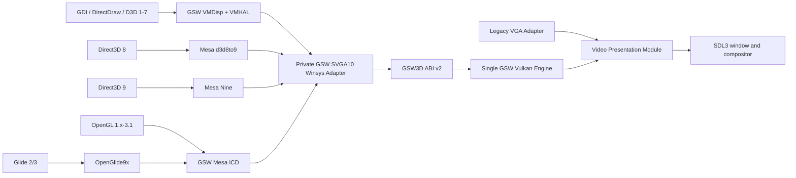

<!-- SPDX-License-Identifier: GPL-3.0-only -->

# RETVRN99 Full GSW Graphics Stack

## Status

Approved implementation plan. This document fixes the target architecture and
release gates. It is not evidence that a phase, capability, build, installation,
or guest-runtime gate has passed. Each claim remains disabled until its named
proof is complete.

### Implementation progress: 2026-07-22

- Recovery checkpoint: the removed isolated worktree was recreated at
  `C:\tmp\retvrn99-graphics-source-closure` from local and live remote branch
  `graphics-source-closure`, both at
  `3428367a86a0265d8320214ba2533c407624501d`. Live `origin/main` remained
  `df7030c089f4e6284355f1eee2206fe9d781e574`. The dirty
  `graphics-telemetry` checkout was inspected but not changed. The Mesa
  component closure is ready at 1,687 unique files and 652
  `compiler-dependency` roles. Its 869-disposition schema-v3 Compiler Closure
  and nine-gate build profile are `compile-proven`. Phase 1 remains open for
  the separate `libs/vkd3d-shader` and OpenGlide9x file/license closures.
- Integration checkpoint: an early build-profile mutation-suite invocation
  overlapped the profile schema rewrite and failed 82 of 96 cases because the
  verifier and fixtures still bound the previous schema digest. This was not a
  completed gate attempt; the partial result was discarded, and every build,
  link, staging, installation, activation, renderer, and capability
  authorization remains false.
- Input checkpoint: the LF source checkout and the independent CRLF license
  checkout are clean at Mesa9x commit
  `29b9adb44bc5ea54dc53c02b5e4b49292c6cc04f`; the pinned i686 GCC and G++
  report MSYS2 15.2.0. The two read-only generated roots each contain 67 files
  and 34,876,554 bytes. No source fetch, download, guest run, or host-mutating
  acceptance was performed.
- License-gate attempt 1 failed closed before source acceptance because the
  generated file rows used culture-sensitive ordering. The generator was
  corrected to use ordinal ordering and reproduced the same 1,687 files, 652
  `compiler-dependency` roles, and 1,502 evidence rows. The corrected
  1,363,950-byte manifest has SHA-256
  `11020fe9315d80f3ebb14f50266bd50e9f2f2e982c9464c8b0d3d42556fd4f2a`;
  the canonical source-bound rerun remains pending at this checkpoint.
- License-gate attempt 2 passed component parsing and then failed closed at the
  linked-manifest input bound: the previous 1 MiB limit rejected the reviewed
  1,363,950-byte manifest. The driver-source verifier now uses the same 4 MiB
  component-manifest ceiling as the canonical closure verifier. No evidence
  was promoted; a complete source-bound rerun remains pending.
- License-gate attempt 3 passed against the clean independent CRLF checkout at
  commit `29b9adb44bc5ea54dc53c02b5e4b49292c6cc04f`: the canonical verifier
  reported one ready component closure with 1,687 exact files, 652
  `compiler-dependency` roles, and 1,502 file-level evidence rows. The
  1,363,950-byte manifest SHA-256 is
  `11020fe9315d80f3ebb14f50266bd50e9f2f2e982c9464c8b0d3d42556fd4f2a`.
  The 33-case component-v2 mutation suite, JSON Schema validation, manifest
  test, and idempotent ordinal regeneration also passed. Mesa component
  licensing is ready; reproducible 869-unit object compilation is the next
  open Mesa blocker.
- Compiler source-root attempt 1 failed closed before compilation on
  `extra/knownfolders.c`. That selected file is a CRLF Git blob, exposing that
  the first materializer compared normalized LF worktree bytes directly with
  the raw Git-blob descriptor. No 1,489-file root or object evidence was
  published. The materializer must bind the raw blob first, derive canonical
  LF bytes from it, and compare both clean checkout observations before the
  object gate can run.
- Compiler source-root attempt 2 again failed closed on the same raw-CRLF blob
  because the LF-configured checkout still required every individual file to
  contain LF bytes. The contract now validates each pair instead: at least one
  raw observation must match the exact Git descriptor, both normalize to the
  same LF bytes, and the two clean checkouts must demonstrate an independent
  LF/CRLF observation. No output root or object evidence was published.
- Compiler source-root attempt 3 validated the pair contract and then failed
  closed while publishing a selected zero-byte file because PowerShell
  enumerated an empty `byte[]` return as `$null`. The helper now returns an
  explicit descriptor object, the six source-root and eleven COFF/object
  mutation tests pass, and the temporary root was again removed before rerun.
- Compiler source-root attempt 4 passed and materialized exactly 1,489
  canonical-LF files from distinct clean checkouts at the pinned commit. Every
  selected pair is anchored by at least one exact raw Git-blob observation,
  both observations normalize identically, and independent LF/CRLF behavior is
  present. The production 869-unit twin object gate is now the open blocker.
- Object-gate attempt 1 stopped before its first compiler child while the
  collector rechecked canonical `mesa9x.h` bytes against the raw CRLF component
  descriptor. It emitted no evidence and left no object tree. Exact-source
  collection now repeats the raw-anchor/canonical-pair check through a distinct
  clean Git checkout, then rehashes dependency bytes against the canonical
  descriptors before compilation.
- Object-gate attempt 2 stopped before its first compiler child because the
  retry incorrectly requested reusable depfiles from the intentionally empty
  failed proof root. No evidence or object tree exists. The verified temporary
  root will be removed and the corrected collector rerun as a fresh proof.
- Object-gate attempt 3 compiled the first disposition twice through dependency
  and compile-only commands, deleted both temporary objects, and then rejected
  the valid `knownfolders.c` COFF because its section count exceeded an
  arbitrary 96-section policy cap. The parser now accepts any nonzero 16-bit
  section count whose complete table and referenced ranges fit the bounded
  object; malformed range checks remain fail-closed. No evidence was emitted.
- Object-gate attempt 4 passed both runs for `knownfolders.c` and then failed
  closed while compiling disposition `cmd-0002`, upstream
  `threads_posix.c`. The curated common profile intentionally omits the
  upstream recipe's global `HAVE_PTHREAD` definition, so the selected POSIX
  implementation saw the incompatible Win32 type branch in `c11/threads.h`.
  No evidence was emitted, all temporary objects were deleted, and every
  authorization remains false. The next gate attempt must bind a single-unit,
  compile-only `HAVE_PTHREAD` header-selection override to `cmd-0002` without
  admitting the excluded winpthreads source/include tree or granting link or
  runtime authority.
- Object-gate attempt 5 bound that exception as one exact evidence row applied
  to dependency and object profiles after common arguments and before language
  arguments. It completed both runs for 15 units, including
  `threads_posix.c`, then failed closed at `cmd-0016`, upstream
  `gl_nir_link_uniforms.c`. The selected `nir_builder.h` could not see generated
  NIR opcode declarations such as `nir_ine` and `nir_fmul`. No evidence was
  emitted and every temporary object was deleted. The next blocker is to make
  generated NIR headers take precedence only where the reviewed generated lock
  requires them, without admitting an unreviewed source or backend path.
- Object-gate attempt 6 made every reviewed generated include root precede the
  canonical source roots, completed 150 twin units, and then received an
  undiagnosed exit code 1 from dependency run B of `cmd-0151`, upstream
  `nir_lower_indirect_derefs.c`. No depfile or diagnostic text was produced.
  The collector emitted no evidence and retained zero objects. Four subsequent
  isolated commands under the collector's exact pinned environment, covering
  `cmd-0001` and `cmd-0150` through `cmd-0152`, all returned zero and produced
  depfiles. This identifies a transient child failure rather than accepted
  evidence; the next attempt remains a completely fresh, no-reuse proof.
- Object-gate attempt 7 passed the previous failure point and completed 325
  twin units. The next `cmd-0326` object was rejected because section 2's raw
  data range exceeded the file bounds. No evidence was emitted and zero
  objects remain. An isolated exact compile of the same `dd_screen.c` unit
  produced a valid 11,959-byte, four-section i386 COFF object whose `.bss`
  section has zero raw bytes and offset. The initial transient-output diagnosis
  was not accepted as a parser change; the next fresh gate added an explicit
  one-child execution bound and a one-second quiescence/collection point after
  each 25 units, without retrying or reusing any compiler result.
- Object-gate attempt 8 repeated the same section-2 rejection immediately after
  325 complete twin units despite that execution bound. This disproves the
  transient diagnosis for `cmd-0326`. COFF permits an uninitialized-data
  section to carry its logical size while `PointerToRawData` remains zero; the
  parser now accepts that combination only when
  `IMAGE_SCN_CNT_UNINITIALIZED_DATA` is set, while initialized sections with a
  missing or out-of-range raw-data pointer still fail closed. No evidence was
  emitted and zero objects remain.
- Object-gate attempt 9 passed the corrected COFF validation and completed 791
  twin units before `cmd-0792`, upstream `src/util/rwlock.c`, failed during
  object run A. The pinned Windows headers did not declare
  `InitializeSRWLock`, `AcquireSRWLockShared`, `ReleaseSRWLockShared`,
  `AcquireSRWLockExclusive`, or `ReleaseSRWLockExclusive` in the selected
  compile context, and warnings-as-errors rejected the resulting implicit
  declarations. The collector emitted no evidence, deleted every temporary
  object, and retained 1,583 diagnostic depfiles only. The exact Windows target
  version and upstream recipe context for this unit are the next open blocker;
  no source, link, runtime, or capability claim is promoted.
- Attempt-9 diagnosis confirmed that the pinned Mesa9x MinGW recipe defines
  `HAVE_PTHREAD` globally and links its separately excluded vendored pthread
  layer. An exact isolated `cmd-0792` compile instead passed with the same
  narrowly bound, compile-context-only definition already used by
  `threads_posix.c`; its temporary 1,009-byte object was deleted. A diagnostic
  preflight then compiled 77 of the 78 dispositions from `cmd-0792` through
  `cmd-0869` and stopped at generated `cmd-0852`, `glapi_x86.S`, where the
  assembler rejected line 100 as junk following a comma. The preflight emitted
  no production evidence, retained zero objects, and removed its proof root.
  The exact generated assembly syntax and pinned recipe context are now the
  next open blocker. Pthread linking, ABI compatibility, and runtime behavior
  remain explicitly unproven.
- The corrective preflight binds three ordered, source-specific compile-context
  exceptions: `HAVE_PTHREAD` only for `cmd-0002` and `cmd-0792`, and
  `USE_X86_ASM` plus `GLX_X86_READONLY_TEXT` only for generated `cmd-0852`.
  All three definitions remain forbidden in common profiles and every other
  disposition. A fresh exact preflight of `cmd-0852` through `cmd-0869` then
  compiled all 18 units with zero failures, retained zero objects, and removed
  its diagnostic root. The 1,583 attempt-9 depfiles were also verified to have
  zero accompanying objects or evidence and then removed with their proof root.
  This is diagnostic preparation for a completely fresh full gate, not
  production evidence or link/runtime proof.
- Pre-attempt-10 validation passed all 27 compiler-closure mutations, both the
  schema-2-to-3 and schema-3-to-3 synthetic writer/verifier/JSON Schema paths,
  all 12 source-root role and canonicalization tests, and the Mesa component
  manifest test. Exact LF/CRLF `cmd-0852` objects were both 131,418 bytes with
  identical raw and normalized SHA-256
  `fb900847ab7f8883befc5a4bdeeecea9c08be08c1dade3e151e6decf3abc352a`;
  COFF and private-path validation passed and both objects were deleted. The
  18,052-byte compiler schema SHA-256 is
  `afd26827ca46257b4f42c436f11671615760908f135eb3d58b3ea6a3b68d0008`.
  Both the production proof root and evidence path were absent before the next
  full attempt.
- The first strengthened target-version mutation run reported 2 failures out
  of 29 because the two new tests supplied wildcard-like expected-message text
  to a literal-substring assertion. Both mutations did make the verifier reject
  dependency or object profile promotion to a post-Win98 target, while the
  other 27 mutations passed. After correcting only those assertion strings, a
  fresh run passed all 29 mutations plus both schema-2-to-3 and schema-3-to-3
  synthetic writer/verifier/JSON Schema paths. Object-gate attempt 10 may now
  start from absent proof and evidence paths.
- Object-gate attempt 10 completed all 869 dependency and object commands in
  both LF/CRLF runs, including `cmd-0792` and `cmd-0852`, with no compile,
  normalized-object, COFF, collision, or private-path failure. It then failed
  closed before evidence publication in the collector's final exact-source-root
  reconstruction. That postcondition combined the 837 upstream source units
  with only the 651 source-root headers observed by compilation, omitting the
  exact zero-byte `nir_builder_opcodes.h` component role shadowed by the reviewed
  generated header, and therefore rejected the expected 1,489-file root. The
  collector emitted no evidence, deleted every temporary object, and retained
  exactly 1,738 diagnostic depfiles. The shared 652-role resolver must also be
  used by this final collector postcondition before a completely fresh gate is
  attempted; no readiness or authorization is promoted.
- The collector now applies the shared dependency-role resolver to its final
  exact-source postcondition, requires the ready component's exact zero-byte
  shadowed role, and reconstructs all 652 role paths rather than only 651
  observed source headers. All 12 role/canonicalization tests, collector parsing,
  and the scoped diff check passed. The attempt-10 proof root was verified to
  contain exactly 1,738 depfiles, zero objects, and no evidence, then removed.
  Proof and evidence paths are absent for a fresh attempt 11.
- Object-gate attempt 11 passed. Exactly 869 dispositions completed dependency
  and object compilation in both runs: 1,738 object compiles, 869 unique object
  identities, zero failed compiles, zero collisions, and zero retained objects.
  All normalized A/B hashes match, and the ordered aggregate object SHA-256 is
  `d418c61b73a8ddf7b8939741b9e64fde1fd301a2c47a195779098dba6c0c1568`.
  The strict 1,530,270-byte evidence file has SHA-256
  `46b7a9c00a9894c336daf6d73cb2f07054de0a73afb2039e90410b652c847344`
  and records exactly 1,070 dependencies: 651 source, 29 generated, four
  original, and 386 toolchain files. Its three ordered unit overrides are
  present, private absolute paths are absent, the recorded aggregate recomputes
  exactly, and all 1,738 diagnostic depfiles coexist with zero `.o` files. This
  proves the Mesa compile-only sub-gate; it does not authorize linking,
  production artifacts, installation, activation, renderer selection, or any
  graphics capability.
- Compiler-closure promotion attempt 1 failed closed before replacing the
  tracked closure on `mesa9x.h`. The ready component manifest correctly binds
  that file's raw CRLF Git blob, while compiler evidence correctly binds the
  canonical-LF materialized bytes. The writer still compared those unlike byte
  representations directly. No compiler or build-profile state was promoted.
  The writer must require exact dependency-role membership and leave raw-Git to
  canonical-LF equivalence to the already proven source-root contract, while
  retaining external canonical-root hash verification when that root is
  supplied.
- Compiler-closure promotion attempt 2 passed the revised canonical dependency
  checks after all 14 role/normalization tests passed, then the workspace
  sandbox denied the final tracked-file write. The existing schema-2 closure
  remained unchanged. This is an infrastructure-only failure; the identical
  writer must be rerun with the required workspace write permission before any
  promotion claim is made.
- Compiler-closure promotion attempt 3 passed with the required workspace write
  permission. The schema-v3 `compile-proven` closure is 1,573,468 bytes with
  SHA-256
  `7e328a3edcfdee017e7bdbdf71f7810723d216ef5e6394549cb1b62822087c1e`.
  It binds 869 commands, 1,070 dependencies, 869 twin object records, the
  ordered aggregate
  `d418c61b73a8ddf7b8939741b9e64fde1fd301a2c47a195779098dba6c0c1568`,
  and zero true authorizations. Both metadata-only verification and full
  verification against the canonical source root, reviewed generated root,
  original GSW root, and locked extracted toolchain passed. The five exact raw
  CRLF dependency descriptors are separately bound to canonical-LF descriptors;
  the other 646 observed source dependencies match their ready component bytes
  directly.
- Build-profile gate attempt 1 passed. The final 8,403-byte schema SHA-256 is
  `de12369b6640a83880ac187478853f981e14df907ff6152c8dde024ba3e74e26`,
  and the 4,240-byte schema-2 profile SHA-256 is
  `08d309118ad88b573410552dad851cacffbddafa4e3d856e9ffff7eb74faaa6a`.
  The `compile-proven` profile binds all nine ordered evidence gates, including
  the compiler-closure SHA-256 in the CPU, backend-exclusion, and compile-output
  gates. Direct verification and all 99 profile mutation tests passed.
  Compile-only is true; production build, link, staging, guest installation,
  DLL activation, renderer selection, and capability advertisement all remain
  false.
- Post-promotion component source-bound rerun attempt 1 stopped before source
  acceptance because Git rejected the clean
  `C:\tmp\retvrn99-mesa9x-lf2` checkout as dubious ownership under the
  sandbox's offline account. The tracked ready manifest and all compiler and
  build-profile evidence remained unchanged. The identical read-only gate must
  be rerun with host permission; this infrastructure failure does not promote
  any link, staging, installation, activation, renderer, or capability claim.
- Post-promotion component source-bound rerun attempt 2 passed the ownership
  boundary with host permission and then failed closed because the `lf2`
  checkout reports local origin `D:\src\retvrn99-win98\mesa9x`, not the
  locked GitHub origin. No manifest or proof state changed. Another clean
  pinned checkout must satisfy both commit and exact-origin provenance before
  this redundant source-bound rerun can pass.
- Windows 98 regression batch B passed seven of twelve script suites: Mesa GSW
  winsys shell 9/9, original source 23/23, guest CPU profile 37/37, GSW3D guest
  transport 6/6, GSW-VGA PnP lifecycle 8/8, GSW-VGA pipeline 3/3, and GSW GDI
  routing 4/4. Five suites failed closed: one of 19 original-build mutations
  reached an earlier compile-plan/toolchain descriptor mismatch instead of its
  expected final-metadata message; GSW-Sound source retained the previous
  `upstream.lock.tsv` hash; and the GSW3D smoke, GSW2D bench, and GSW-VGA binary
  boundary suites require unavailable payload and toolchain roots. No payload
  was built or staged. The two stale metadata expectations must be updated and
  rerun; the three parameterized binary suites remain explicitly not executed
  against a payload.
- Windows 98 regression batch C passed seven of eight script suites: driver
  toolchain, driver sources, derived sources, component-derived sources,
  component closure v1 and v2, and the staging-script mutation suite. The
  end-of-line reproducibility harness was not exercised because its mandatory
  source, toolchain, and proof roots were not supplied; it failed closed at
  parameter binding and created no proof output. This is an unexecuted
  parameterized proof, not production staging or activation evidence.
- Post-promotion component source-bound rerun attempt 3 passed against the
  clean locked-origin checkout at `D:\src\retvrn99-win98\mesa9x`, commit
  `29b9adb44bc5ea54dc53c02b5e4b49292c6cc04f`. The exact 1,687-file,
  652-dependency-role manifest regenerated idempotently and source-bound
  verification passed; the two local LF proof clones remain correctly rejected
  for their noncanonical origin metadata.
- The two actionable batch-B metadata regressions were repaired and rerun. All
  19 original GSW build mutations now pass after rebinding the current
  24,574-byte toolchain verifier with SHA-256
  `4a38d41118a3812eb7ccc973cd0706c2edbc92656c78f34941f8c7ca96868291`,
  including a new verifier-digest negative case. All nine GSW-Sound source
  contracts pass after rebinding the current upstream lock, toolchain verifier,
  and strict-JSON helper, including an explicit upstream-lock assertion. These
  are metadata and mutation-test repairs only; no binary payload was produced.
- The three generic script suites also passed: Win16 date normalization,
  workload-gate policy, and strict-input boundaries. The first whole-tree Odin
  command, `odin test . -all-packages`, failed before compilation because this
  repository root contains no `.odin` files. No test executable was created.
  The all-packages rerun must target the repository's actual aggregate Odin
  package root while retaining a temporary output outside the worktree.
- Windows 98 regression batch A passed eight of nine script suites: source seed
  30/30, object proof 14/14, direct build plan 6/6, generator toolchain 39/39,
  generated sources 13/13, generated-source reproducibility 32/32, the default
  component manifest contract, and compiler source root 14/14. The generated
  output-lock suite passed 58 cases, failed nine, and skipped five root-bound
  cases. Every failure was intercepted by a stale 1 MiB component-manifest
  ceiling before reaching the intended v2 mutation assertion. The ceiling must
  match the accepted 4 MiB component contract, then the complete suite must be
  rerun with both reviewed generated roots.
- Whole-tree Odin attempt 2 targeted `src -all-packages` and reached the link
  step, then the sandboxed linker failed with `LNK1104` while opening the named
  `C:\tmp\retvrn99-graphics-source-closure-odin-tests.exe` output. No test
  executable was created. The identical all-packages test requires host write
  permission for that single temporary path before any Odin result is claimed.
- Whole-tree Odin attempt 3 ran with host permission and executed 1,317 tests:
  1,276 passed and 41 failed. Every failure was in the process-backed FAT32
  adapter or a caller of it because the required temporary
  `RETVRN99-FAT32.exe` helper was not adjacent to the temporary test runner;
  failures reported `Helper_Missing`, and no graphics or Mesa Odin test failed.
  The established temporary helper-plus-runner layout must be reproduced and
  the full `src -all-packages` suite rerun before handoff. This is test
  infrastructure only, not installation or staging authority.
- Whole-tree Odin attempt 4 stopped before creating its proof directory because
  the wrapper used unsupported `New-Item -LiteralPath` syntax. No helper,
  runner, or test result was produced. The exact validated temporary directory
  and command are unchanged apart from correcting that PowerShell parameter.
- Whole-tree Odin attempt 5 built the temporary helper and removed all
  `Helper_Missing` failures, but the default 32-thread runner timed out in PIT
  calibration and the WHPX watchdog, then hit a segmentation fault in a
  SeaBIOS reset test and did not drain. Only the identified temporary test,
  Odin-parent, and helper processes were stopped. The repository's process-test
  harness explicitly serializes shared timing, lock, and memory assertions with
  `ODIN_TEST_THREADS=1`; the fresh whole-tree rerun must use that established
  bound rather than accepting the unstable parallel result.
- Whole-tree Odin attempt 6 passed. With the debug FAT32 helper adjacent to the
  runner and `ODIN_TEST_THREADS=1`, all 1,317 `src -all-packages` tests passed
  in 3 minutes 6.724 seconds. The helper and runner were temporary test outputs
  under `C:\tmp`; they grant no production-build, staging, installation, or
  activation authority and are removed after this recorded result.
- The generated-output-lock regression was corrected with a dedicated 4 MiB
  component-closure bound at both initial and final stability checks, while all
  unrelated metadata/evidence limits remain unchanged. V2 now requires the
  promoted `ready` component with an empty reason and performs structural
  mutations before external-byte audits; an unmutated proof still requires and
  rechecks all Git and generated evidence. The rootless suite passed 68 cases,
  skipped the five explicitly root-bound cases, failed zero, and now rejects a
  component larger than 4 MiB. The final 73-case run against both reviewed
  generated trees remains pending.
- Generated-output-lock root-bound attempt 1 passed 68 of 73 cases. Five Git
  evidence cases failed before their intended assertions because the host-run
  suite used the sandbox-owned `mesa-generation-lf` checkout and Git rejected
  its ownership. Both generated roots remained read-only and no fixture escaped
  the temporary test tree. The identical suite must use the clean pinned
  host-owned Mesa checkout as its Git evidence root.
- Generated-output-lock root-bound attempt 2 passed all 73 cases against the
  clean host-owned Mesa checkout and both reviewed LF/CRLF generated roots.
  This includes exact source evidence, identical normalized trees, stale/hash/
  ordering/license/authorization mutations, final stability seams, reparse and
  collision defenses, and the 4 MiB-plus-one component bound. No outputs were
  generated or retained by this verification run.
- The generated-source reproducibility suite passed all 33 cases against both
  reviewed production roots, including exact normalized-tree equality, paired
  and distinct root constraints, digest/recipe/seed mutations, scratch-path
  rejection, and every explicit false authorization and unproven claim.
- Final full compiler-closure recheck attempt 1 failed before byte validation
  because `ToolchainRoot` was supplied as the containing `toolchains` directory
  rather than the lock's extracted
  `msys2-mingw32-gcc15.2.0-20260717` root; the first lookup therefore reported
  `toolchain/include/_bsd_types.h` absent. No closure or input changed. The
  identical verifier must be rerun with the exact extracted root.
- Final full compiler-closure recheck attempt 2 passed against the 1,489-file
  canonical source root, reviewed generated root, original GSW sources, and the
  exact extracted toolchain. It reverified 869 commands, 1,738 twin depfiles,
  869 twin normalized i386 COFF objects, ordered aggregate
  `d418c61b73a8ddf7b8939741b9e64fde1fd301a2c47a195779098dba6c0c1568`,
  and zero true authorizations.
- Final metadata validation passed strict JSON and JSON Schema checks for the
  ready component closure, schema-v3 compiler closure, and schema-v2 build
  profile. Metadata-only compiler verification repeated the 869/1,738/869
  counts and ordered aggregate, and build-profile verification reported
  `compile-only=true` with production build, link, staging, installation,
  activation, renderer/capability authority all false.
- Final script-matrix accounting passed all 31 suites that do not require a
  prohibited production payload/build proof. Four artifact-dependent harnesses
  failed closed at mandatory parameter binding: driver EOL reproducibility
  would build and link the full driver plan, while GSW3D smoke, GSW2D bench, and
  GSW-VGA binary-boundary tests require an existing payload and toolchain root.
  None was supplied or created because production build, link, and staging
  authority remains false. The successful matrix includes the 33-case
  component-v2 suite, 30 compiler-closure mutations, 14 source-root cases, 14
  object-proof cases, 73 generated-output-lock cases, 33 generated-source
  reproducibility cases, 99 build-profile mutations, and the original GSW
  source/build and winsys suites.
- Final hygiene checks parsed all 23 changed PowerShell scripts and all ten
  changed JSON files strictly, passed `git diff --check`, and found zero changed
  binaries, objects, archives, ISOs, images, `.scratch` contents, AI artifacts,
  missing SPDX script headers, or forbidden backend inputs. The pre-commit
  scope contains 33 modified text files plus seven new PowerShell scripts, all
  under `docs`, `drivers/win98`, or `scripts`; production authorization fields
  remain false throughout tracked evidence.
- Handoff cleanup verified the production proof tree contained exactly 1,738
  depfiles and zero objects or other files, rechecked the temporary evidence as
  1,530,270 bytes with SHA-256
  `46b7a9c00a9894c336daf6d73cb2f07054de0a73afb2039e90410b652c847344`,
  then removed both the proof tree and evidence file. The temporary Odin helper,
  debug symbols, and test runner are also absent. The 1,489-file canonical
  source root remains object-free as a reproducibility input; no binary or
  generated proof artifact is part of the change.
- Pre-publication handoff recheck on 2026-07-22 found branch
  `graphics-source-closure` and live `origin/graphics-source-closure` still at
  base HEAD `3428367a86a0265d8320214ba2533c407624501d`; live `origin/main` remains
  `df7030c089f4e6284355f1eee2206fe9d781e574`. The separate
  `graphics-telemetry` worktree remains untouched. The next open Phase 1
  blocker is the independent `libs/vkd3d-shader` and OpenGlide9x file/license
  closure, not Mesa compilation.
- Publication attempt 1 stopped before staging because the sandbox could not
  create the isolated worktree's index lock under the protected main repository
  metadata. All 40 audited paths remained unstaged and unchanged. The same
  exact path list requires host permission for branch-only commit publication;
  no merge or `main` update is authorized.
- Phase 1 remains open for the separate `libs/vkd3d-shader` and OpenGlide9x
  file/license closures. The exact direct-build inventory contains 837
  upstream, 35 generated, and two original GSW source units: 869 compile
  dispositions and five support-only generated files. The Mesa schema-2
  component closure is ready with 1,687 files and 652 `compiler-dependency`
  roles. Its 1,489-file canonical source root fed two successful runs of all
  869 dispositions, observing 1,070 dependencies and producing 1,738 validated
  i386 COFF objects with zero failures, collisions, or retained objects. The
  schema-v3 Compiler Closure and all-nine-gate build profile are
  `compile-proven`; link, production, staging, installation, activation,
  renderer, and capability authorizations remain false.
- An original capability-disabled GSW `svga_winsys_screen` shell now populates
  all 32 screen callbacks and all 17 context callbacks. It reports a pre-WS8
  hardware version, exposes no capabilities, rejects resource and fence-FD
  operations, emits no ABI traffic, and retains failed-create ownership. This
  is only a fail-closed Interface shell and does not implement the Phase 7 ABI
  v2 Adapter.
- OpenGL, Direct3D, Nine, d3d8to9, Glide, SVGA10 decoding, Vulkan rendering,
  build, link, staging, payload, installation, DLL activation, and capability
  authorization all remain disabled. The graphics stack is not integrated.

## Summary and fixed decisions

Build a full-featured Windows 98 graphics stack around one private GSW-VGA
device and one Vulkan Implementation. SoftGPU is a knowledge and source donor,
not a dependency, installer, device identity, or runtime backend selector.

The finished capability target is:

- DirectDraw and legacy Direct3D 1-7 through VMHAL9x.
- Direct3D 8 through Mesa d3d8to9.
- Direct3D 9c through Mesa Nine, including Shader Model 3.0.
- OpenGL 1.x through OpenGL 3.1 plus `ARB_compatibility`, with GLSL 1.40.
- Glide 2.x and 3.x through OpenGlide9x.
- Windowed, fullscreen, multi-context, and multi-process rendering.
- One host renderer: Vulkan through SDL GPU.
- No WineD3D, softpipe, llvmpipe, VirGL, qemu-3dfx, VESA/Bochs 3D,
  VMware device emulation, or user-selectable renderer.

SVGA gen10 remains only an internal command language generated by Mesa.
RETVRN99 continues to expose `PCI\VEN_FFFE&DEV_0002`. VMware registers, FIFO,
GMR/MOB transport, branding, and installer logic are excluded.

The 256 MB RAM, 32 MB framebuffer aperture, and GSW-886 CPU persona are hard
constraints. SoftGPU's higher memory recommendations come from its
multi-renderer package and guest-backed vGPU10 resources, which this design
intentionally avoids. [SoftGPU's upstream architecture and capability
matrix](https://github.com/JHRobotics/softgpu/blob/be7a6421068a1d1f475b8939a24237921490c2b8/README.md)
remain reference material.

## Modules and public Interfaces

| Module | Ownership and Interface | Depth and deletion test |
|---|---|---|
| Legacy VGA | BIOS, DOS, VGA/EGA/CGA, Mode X, VBE registers, palette, timing, and legacy scanout | Retained as a compatibility Adapter. Removing it would spread legacy hardware behavior across Machine and presentation. |
| Video Presentation | Mode generations, dirty regions, window clip regions, active source, coalescing, aspect handling, reset, and last-good frame | Both Legacy VGA and GSW provide Adapters. Removing it would recreate presentation policy in the VM thread, mailbox, compositor, and Vulkan engine. |
| GSW Device and Coherence | Private PCI/MMIO identity, sessions, resources, mappings, ownership transitions, fences, resets, and command validation | The sole guest-facing device Module. Removing it would spread untrusted protocol and coherence rules into Machine and Vulkan code. |
| GSW Vulkan Engine | Resources, formats, shaders, pipelines, queries, command submission, physical fences, and presentation | One concrete production Implementation. Test fakes remain confined to `*_tests.odin`; there is no production renderer Interface. |
| Graphics Telemetry | Correlated frame/device epochs and bounded performance counters | Retained permanently as the proof surface for performance, resets, and capability qualification. |

## GSW3D ABI v2

Replace production use of the current proof ABI with a fixed-width,
little-endian, fail-closed Interface:

- Add `GSW3D_PACKET_GSW_SVGA10`; keep SVGA9 reachable only by developer
  fixtures.
- Every request contains `cb`, ABI version, device generation, session handle,
  and operation-specific fields. Every result contains status, error,
  submitted fence, completed fence, and device generation.
- Add session create/destroy, context create/destroy, resource create/destroy,
  map/unmap, upload/download, submit, present, fence query/wait, and
  device-reset requests.
- Allocate generational handles in the VxD/host. Remove caller-chosen IDs.
- Bind every context, resource, region, fence, and present to its owning session
  and process. Process exit destroys its complete ownership tree.
- Retain the 4 KiB control ring for descriptors. Add a global VxD-owned pool of
  two 512 KiB command slots and two 4 MiB bulk-transfer slots. Only these
  page-locked, registered ranges may be referenced.
- Set maximum command size to 32 KiB, maximum batch size to 512 KiB, maximum
  queued batches to 32 per context, and maximum globally owned queued bytes to
  16 MiB.
- Bound the VM to 64 sessions, 128 contexts, 8,192 combined resources/state
  objects, 16 pending presents, and 256 MiB of host-resident GPU resources.
- Keep the guest-visible framebuffer heap at 32 MiB. DirectDraw reports that
  heap separately from the private 256 MiB host-resource budget used by GSW3D.
- Reject malformed sizes, overflow, stale generations, cross-session handles,
  illegal state transitions, unsupported formats, and dependency cycles before
  enqueuing any part of a batch.

## Capability profiles

Advertise two immutable, hash-identified profiles:

- `GSW_D3D9_SM3`: D3D9c, Shader Model 3.0, fixed-function emulation, hardware
  T&L, four render targets, depth/stencil, instancing, render-to-texture,
  multisampling, event queries, and occlusion queries.
- `GSW_GL31_COMPAT`: OpenGL 3.1, GLSL 1.40, and `ARB_compatibility`, including
  framebuffer objects, VBOs, instancing, transform feedback, texture arrays,
  uniform buffers, S3TC, anisotropy, and non-power-of-two textures.

Do not advertise OpenGL 3.2+, geometry/tessellation stages, Direct3D 10+, or
unsupported query classes. SDL GPU's graphics pipeline is based on vertex and
fragment stages, so OpenGL 3.1 is the honest ceiling for this Implementation.
See the [SDL GPU feature model](https://wiki.libsdl.org/SDL3/CategoryGPU).

## Guest package shape

The final deterministic package set is:

- `gsw-vga`: `gswmini.inf`, `gswmini.drv`, `gswmini.vxd`, `gswhal9x.dll`,
  `gswdd32.dll`, and `gswgl32.dll`.
- User-supplied DirectX 9 runtime: RunOnce order 100, never committed or
  redistributed by RETVRN99.
- `gsw-dx9-compat`: `mesa99.dll` and `mesa89.dll`, RunOnce order 200.
- `gsw-glide`: `glide2x.dll` and `glide3x.dll`, RunOnce order 300.

The display driver reports the OpenGL ICD and accelerated Direct3D capabilities
only when the installed package manifest, guest ABI, host profile hash, and
runtime capability negotiation all agree.

## Implementation chain

### Phase 0: Establish the performance baseline

- Add one correlated frame epoch covering VM execution, GSW/VGA writes, dirty
  bytes, descriptor-copy bytes/time, pixel conversion, texture upload, Vulkan
  submission, physical-fence completion, queue depth, coalescing, texture
  recreation, input latency, and audio underruns.
- Capture WinQuake at 320x200, 320x240, 640x480, and 800x600. Repeat
  windowed/fullscreen mode changes, process exit, and shutdown.
- Keep logs bounded and aggregate per second, with an opt-in detailed trace
  ring.

Gate: every frame's cost can be attributed to a named stage, and the existing
3-4 FPS collapse has measured ownership before semantics change.

### Phase 1: Close source, license, and build provenance

- Retain the current exact VMDisp9x and VMHAL9x pins.
- Keep Mesa9x pinned at
  [`29b9adb44bc5ea54dc53c02b5e4b49292c6cc04f`](https://github.com/JHRobotics/mesa9x/commit/29b9adb44bc5ea54dc53c02b5e4b49292c6cc04f),
  but allowlist only the Mesa 23.1.9 core, WGL, SVGA Gallium, Nine, and
  d3d8to9 closure. Mesa 23.1.9 is the upstream-tested generation where vGPU10
  and Nine pass together. See the [Mesa9x compatibility
  matrix](https://github.com/JHRobotics/mesa9x/blob/29b9adb44bc5ea54dc53c02b5e4b49292c6cc04f/README.md).
- Promote only `libs/vkd3d-shader` from the pinned vkd3d source for host-side
  legacy/DXBC-to-SPIR-V translation.
- Add OpenGlide9x pin
  [`b8ac1a32c98f9f8e8616aeffcf4b0af163b59b8f`](https://github.com/JHRobotics/openglide9x/commit/b8ac1a32c98f9f8e8616aeffcf4b0af163b59b8f).
- Change Wine9x to reference-only for this plan. Exclude qemu-3dfx and all
  proprietary redistributables.
- Replace GPLv2-only VirtualBox winsys/memory-helper files with original
  GPLv3-only GSW Implementations against Mesa's permissive Gallium Interfaces.
- Add a file-level source/license closure instead of treating all Mesa9x files
  as MIT.
- Pin Python, Mako, PyYAML, flex, bison, and other Mesa generators, or hash-lock
  their generated outputs before compilation.
- Build without LLVM, softpipe, llvmpipe, VirGL, Zink, alternate Mesa
  generations, Win95, or WinMe payloads.
- Compile guest code for the existing CPU contract with an
  i686/MMX/SSE/SSE2/SSE3 profile, explicitly disabling CX16, SSE4, and AVX
  emission. Do not alter CPUID.

Gate: two clean LF/CRLF builds produce identical normalized outputs and pass
the complete source/license closure.

Progress: Mesa's normalized LF/CRLF generated outputs, ready
1,687-file/652-role source-license closure, and 869-unit twin object proof are
complete. Its schema-v3 Compiler Closure and nine-gate build profile are
`compile-proven`. Phase 1 remains open for the separate `libs/vkd3d-shader` and
OpenGlide9x file/license closures; every link, delivery, activation, renderer,
and capability authorization remains false.

### Phase 2: Deepen presentation and remove the resolution bottleneck

- Introduce explicit `Legacy_Frame_Update` and `Gsw_Present` records carrying
  mode generation, surface generation, format, source/destination rectangles,
  dirty rectangles, interval, and fence.
- Stop GSW presentation from mutating Legacy VGA/DISPI state.
- Upload only dirty guest-visible regions. Device-local GSW surfaces remain
  resident on the GPU and present without descriptor copies, CPU conversion,
  or streaming-texture upload.
- For windowed 3D, include a bounded exact clip list of up to 256 guest-screen
  rectangles. Composite the GPU surface over the uploaded Windows desktop
  without routine readback.
- GDI/DD writes overlapping a windowed overlay invalidate the affected overlay
  region. A guest lock/read explicitly downloads the requested pixels.
- Mode changes increment the mode generation and discard stale presents.
  Fullscreen exit, process death, reset, and shutdown restore the last valid
  desktop frame.

Gate on the reference host: GSW presentation has zero steady-state full-frame
descriptor copies, p95 host presentation cost below 4 ms at 1024x768 and 8 ms
at 1920x1080, and no video/input/audio freeze during repeated mode churn.

### Phase 3: Move complete 2D execution into the single Vulkan Engine

- Preserve the existing validated GSW 2D command Interface while changing its
  Implementation to persistent Vulkan resources.
- Implement fill, overlap-safe copy, stretch, color key, clipping, palettes,
  cursor, gamma, YUV overlays, flips, and all 256 ROP3 truth tables.
- Classify resources as guest-visible, device-local, or presentable:
  - Guest-visible memory is authoritative until unlock/dirty notification.
  - Device-local Vulkan memory is authoritative; map/read performs explicit
    download.
  - Presentable surfaces carry mode and fence generations.
- Support RGB565, XRGB1555, ARGB1555, ARGB4444, paletted 8-bit, BGR24,
  BGRA/RGBA32, luminance, depth/stencil, and BC1-3. When a Vulkan format is
  absent, convert within the same renderer rather than selecting another
  backend.

Gate: preserve the existing 256/256 GDI ROP3 proof, add DirectDraw
lock/blit/flip/palette/color-key/overlay tests, and prove reset/coherence under
hostile ordering.

### Phase 4: Land ABI v2 without exposing 3D capabilities

- Implement session ownership, registered staging pools, generational handles,
  transfer chunking, timed fence waits, queue-full behavior, and
  device-lost/reset propagation.
- Validate each batch completely and reserve its resources before committing
  side effects.
- Copy accepted command bytes into host-owned bounded storage before returning
  from the VM thread.
- Keep all 3D capability bits disabled. The existing exact-triangle path
  remains a developer fixture only.

Gate: ABI layout twins in C and Odin, mutation/property tests for every
request, stale-handle and cross-process rejection, queue-pressure tests,
cancellation at every reset point, and deterministic process cleanup.

### Phase 5: Build the SVGA10 decoder and Vulkan resource/state engine

- Create a generated command manifest containing every `SVGA_3D_CMD_*` emitted
  by the selected Mesa 23.1.9 SVGA driver. Each row names size rules, required
  capabilities, validator, semantic work record, executor, and tests.
- Make the build fail if Mesa can emit a command absent from the manifest or if
  the advertised devcap table enables an unimplemented command family.
- Implement contexts, GB surfaces, compact host-owned COTables, buffers,
  textures, views, samplers, render targets, depth/stencil, clears, copies,
  resolves, draws, indexed draws, instancing, and transfers.
- Keep VMware object semantics only where Mesa's command stream requires them;
  map them directly to GSW generational objects without VMware PCI/FIFO/GMR/MOB
  machinery.
- Execute every SDL GPU create/destroy/submit operation on the presentation
  thread. The VM thread only validates, copies, and queues work.

Gate: deterministic command-replay fixtures for every manifest row,
multi-context resource isolation, format/state golden tests, and physical-fence
completion before guest fence advancement.

### Phase 6: Add shader translation, queries, and pipeline caching

- Translate SVGA legacy shader tokens and vGPU10 DXBC with the pinned
  `vkd3d-shader` subset into SPIR-V.
- Validate bytecode size, instruction count, stage, bindings, reflection data,
  and resource counts before translation.
- Perform CPU translation on one bounded worker queue. Create SDL GPU shaders
  and pipelines only on the presentation thread; discard results from stale
  reset generations.
- Cache pipelines by shader hashes, vertex layout, topology,
  blend/raster/depth state, render-target formats, and sample count. Bound the
  cache to 4,096 pipelines with fence-aware LRU retirement.
- Map D3D event queries to physical fences. Implement occlusion and OpenGL
  transform-feedback support with shader-instrumented storage buffers. Do not
  advertise unsupported timestamp or pipeline-statistics queries.

Gate: shader-model 1.1 through 3.0 corpus, malformed shader rejection, cache
eviction under live fences, fixed-function shader permutations, occlusion
accuracy, and transform-feedback round trips.

### Phase 7: Bring up the single GSW Mesa ICD

- Write an original GSW `svga_winsys_screen` Adapter implementing Mesa's
  permissive winsys Interface over ABI v2.
- Synthesize one immutable gen10 devcap table matching the host profile. Do not
  copy VMware register arrays or VirtualBox environment structs.
- Build `gswgl32.dll` from the pruned Mesa 23.1.9 closure.
- Implement WGL context creation/destruction, pixel formats, `SwapBuffers`,
  window coordinates, visible clip regions, minimized-window handling, and
  fullscreen ownership.
- Initially expose only the tested OpenGL version. Raise it feature by feature
  until the complete `GSW_GL31_COMPAT` profile passes, then freeze the profile
  hash.

Progress: the complete callback-table shell exists only in capability-disabled
form and deliberately fails Mesa screen creation before WS8. It has no ABI v2
transport, ICD, advertised OpenGL version, or rendering path. This gate remains
open.

Gate: `glchecker`, `icdtest`, `wgltest`, multi-context and multi-process tests,
OpenGL 1.1/2.1/3.1 conformance samples, window occlusion, fullscreen churn, and
explicit readback.

### Phase 8: Complete DirectDraw and Direct3D 1-9

- Restore VMHAL9x's D3DHAL objects currently omitted from the GSW build and
  route D3D1-7 through the same Mesa/GSW screen.
- Preserve the existing DirectDraw HAL and extend its resource ownership calls
  to ABI v2.
- Build `mesa99.dll` for D3D9 and `mesa89.dll` for D3D8-to-9 from the same Mesa
  closure and capability profile.
- Install one global route per DirectX generation. Do not include WineD3D or
  per-game renderer switches.
- Implement D3D9 lost-device/reset, dynamic/discard/no-overwrite locks,
  render-to-texture, multisampling, depth/stencil, hardware T&L, multiple
  render targets, and Shader Model 3.0.

Gate: `dxdiag` acceleration, DirectDraw diagnostics, D3D1-7 samples, D3D8
samples, D3D9 fixed-function and SM1-3 samples, windowed/fullscreen transitions,
concurrent clients, and reset during queued work.

### Phase 9: Add Glide without another renderer

- Build `glide2x.dll` and `glide3x.dll` from the pinned OpenGlide9x source.
- Route both exclusively through the GSW OpenGL ICD.
- Replace unclear `pthread9x` dependencies with a small project-owned Win32
  synchronization Adapter unless a file-level redistribution review approves
  the exact dependency.
- Support fullscreen and windowed Glide, multiple TMUs, fog, LFB locks, gamma,
  buffer swap, and process teardown.

Gate: Glide2 and Glide3 diagnostics plus Unreal Tournament's Glide path, with
output compared against its OpenGL and Direct3D paths.

### Phase 10: Package, qualify, and retire transitional routes

- Extend the existing derived-source, deterministic-build, payload inventory,
  staging, and Guided Setup plans for the final package set.
- Keep all packages unavailable until their source, build, manifest, and
  licensed guest-runtime gates pass independently.
- Amend the GSW ADRs to record the private SVGA10 IR, ABI v2, resource
  ownership, single Vulkan Implementation, GL3.1/D3D9 profile, and rejected
  alternatives.
- Remove production GSW full-frame scanout copies, synthetic `Vga`
  reconstruction, proof-backend selection, software renderers, and
  VMware-oriented source paths.
- Retain Legacy VGA, exact-triangle fixtures, malformed-command corpora, and
  synthetic test Adapters.
- Deliver each phase on a flat branch. After its gate passes, commit as
  `vorvek`, merge locally to `main`, push `origin/main`, and verify the remote
  SHA. The final capability-activation phase does not merge until licensed
  guest acceptance passes.

## Test and release gates

### Mandatory layered game matrix

Use externally supplied, hash-identified media. Commit no copyrighted game
assets:

- WinQuake and GLQuake.
- Quake II demo.
- Quake III Arena demo.
- Unreal Tournament.
- Half-Life.
- 3DMark99, 3DMark2000, 3DMark2001 SE, and 3DMark03.
- DirectX SDK diagnostics/samples and Mesa diagnostics.

Approved demo and benchmark media may be downloaded into `.scratch` and kept
there until qualification. It remains untracked, must not replace or remove any
existing `.scratch` content, and must not be installed in the guest without
fresh explicit authorization.

For each applicable title:

- Run supported renderers from the single GSW stack at 640x480, 800x600, and
  1024x768.
- Exercise windowed and fullscreen transitions.
- Launch, render, change mode, exit, and relaunch successfully three
  consecutive times.
- Record capability strings, frame timing, queue/fence metrics, memory use, and
  screenshots or frame hashes.
- Treat a guest crash, black frame, stale overlay, input/audio stall, leaked
  context, or shutdown hang as a release failure.

### Memory and performance gates

- VM configuration remains exactly 256 MB RAM and 32 MB guest-visible
  framebuffer memory.
- VxD-locked command/bulk staging remains at or below 9 MiB.
- Peak guest-resident graphics infrastructure, including the pruned ICD,
  remains at or below 64 MiB under 3DMark03.
- Host GPU resources remain within 256 MiB and never spill into guest RAM as an
  invisible fallback.
- No ordinary GSW present performs GPU readback or a full 32 MiB framebuffer
  copy.
- A synthetic 60 Hz producer sustains at least 55 presented frames per second
  at 1024x768 on the reference host.
- A 30-minute mixed OpenGL/Direct3D soak produces no audio underruns, input
  stalls over 100 ms, unbounded queue growth, or resource-budget drift.

### Lifecycle gates

- Clean Device Manager installation with no Code 10.
- Cold boot, warm reboot, shutdown, and restart pass three times.
- Process kill, context loss, mode switch, host fullscreen toggle, device
  reset, and VM stop release every owned resource.
- Concurrent OpenGL and Direct3D clients cannot access each other's objects.
- Stale work from an earlier device generation can neither render nor advance
  fences.
- All existing VGA, host, machine, GDI, driver-pipeline, and acceptance tests
  remain green.

## Assumptions and exclusions

- Windows 98 SE is the primary guest. Windows 95 and Windows Me packages are
  out of scope.
- The user supplies Windows 98, DirectX 9, and game media.
- OpenGL 3.1 plus compatibility is the final advertised ceiling. OpenGL 3.2/4.x
  and Direct3D 10+ require a later raw-Vulkan design and are not silently
  approximated.
- Wine9x may be reconsidered only under a separate ADR after a measured
  title-specific gap. It is not part of this plan.
- Vulkan capability failure disables the matching GSW capability or fails
  startup. It never selects another renderer.
- Existing unrelated work, `.scratch`, and every ISO remain untouched.
- Guest installation or other host-mutating acceptance work requires fresh
  explicit authorization.
